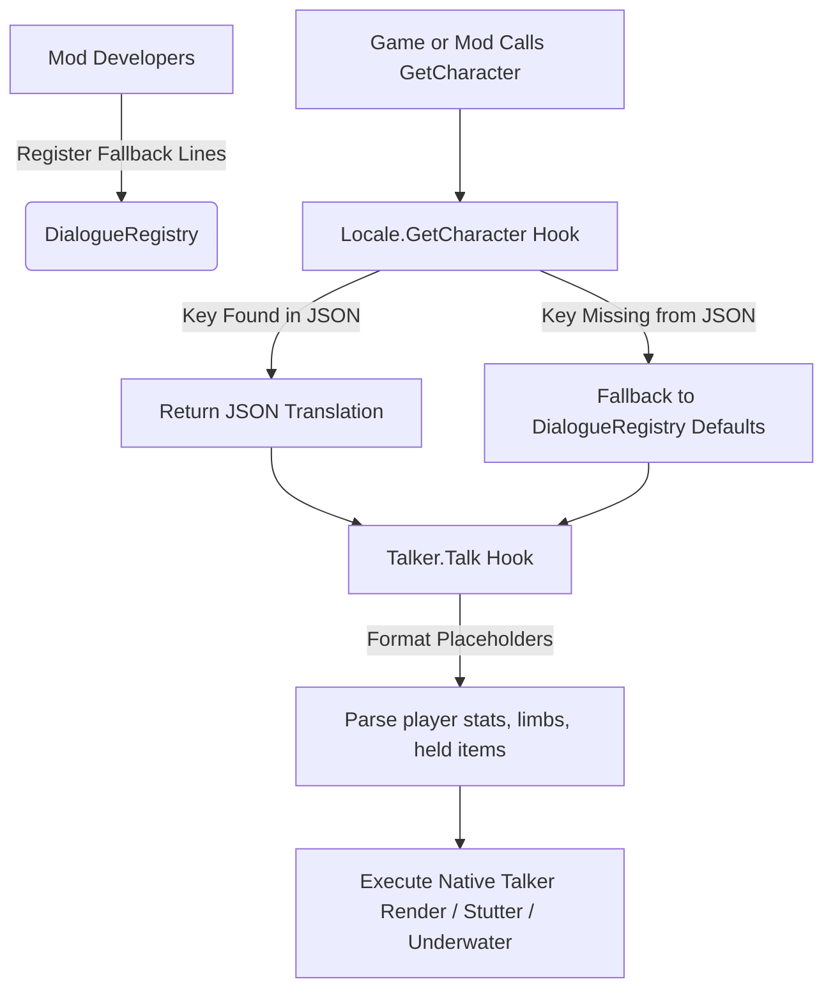

# DialLib (Dialogue Library) — Official API Reference

`DialLib` is a modular, high-performance C# class library/API designed for BepInEx mod developers of **Casualties Unknown**. It extends the game's built-in translation and dialogue systems to support **unlimited custom, highly specific dialogue keys** (e.g. `"laststand"`, `"boss_encounter"`, `"kill_streak"`) with automatic translation fallbacks, safe default lines, and an on-the-fly placeholder formatting engine.

---

## 1. System Architecture

`DialLib` hooks directly into the game's static translation manager (`Locale`) and character speech bubble controller (`Talker`). This allows custom dialogue states to be parsed natively by JSON language files, while offering robust backup defaults for unlocalized versions.



---

## 2. API Structuring

### 2.1 Supported Formatting Placeholders (Tokens)
Mods can include rich, dynamic tags inside their JSON files or default lists. `DialLib` replaces them instantly with real-time gameplay values:

| Placeholder | Replaced Value | Example Output |
| :--- | :--- | :--- |
| **`<player>`** / **`<char>`** | The character's name | `Expie` or `Player` |
| **`<hp>`** | Consciousness / Health percentage | `84%` |
| **`<blood>`** | Active blood volume percentage | `92%` |
| **`<pain>`** | Character's average pain level | `15` |
| **`<adrenaline>`** | Active adrenaline level | `45%` |
| **`<limb>`** | Lowercase name of targeted/injured limb | `left arm` or `head` |
| **`<weapon>`** / **`<item>`** | Name of the currently held weapon or item | `Machete` or `nothing` |

### 2.2 Pre-Registered Dialogue Modes (Out of the Box)
`DialLib` comes with several pre-registered dialogue modes out-of-the-box. These are immediately usable by any mod or can be translated inside `EN.json`:

1. **`laststand`** (Last Stand)
   - Triggered when fighting for survival on critical health or high adrenaline.
   - *Example fallback:* `"I'm not dying here! Not like this!"`
2. **`boss_spotted`** (Boss/Threat Spotted)
   - Triggered when spotting a large, heavy, or unique experimental creature.
   - *Example fallback:* `"That is NOT a normal specimen! Look at the size of it!"`
3. **`low_ammo`** (Out of Ammo)
   - Triggered when firing on empty or during a dry magazine reload.
   - *Example fallback:* `"Click... empty! Need to reload!"`
4. **`critical_bleed`** (Critical Bleeding)
   - Triggered when bleeding heavily or when blood volume is severely low.
   - *Example fallback:* `"I need a bandage now! I've lost <blood> of my blood!"`
5. **`broken_bone`** (Bone Fracture/Dislocation)
   - Triggered when a physical limb is fractured, broken, or dislocated.
   - *Example fallback:* `"Crack... my <limb>! I think it's broken!"`
6. **`healed_limb`** (Limb Treatment)
   - Triggered when a wound or limb is wrapped, patched, or healed.
   - *Example fallback:* `"Applied the dressing. Pain is down to <pain>."`
7. **`stumble`** (Stumbling/Tripping)
   - Triggered when slipping, tripping over loose gravel, or glass.
   - *Example fallback:* `"Tripped on the loose rocks! Nearly broke my <limb>!"`

---

## 3. How to Use DialLib in Your Mod

### Step 1: Declare the BepInEx Dependency
Ensure your mod specifies that it depends on `DialLib`:
```csharp
[BepInPlugin("com.yourname.yourmod", "YourMod", "1.0.0")]
[BepInDependency("com.kanisuko.diallib")]
public class YourPlugin : BaseUnityPlugin
{
    // ...
}
```

### Step 2: Register Dialogues in `Awake()`
Register custom dialogue keys and supply safe English/default fallbacks so the character never accidentally speaks the raw key name in-game.

```csharp
using DialLib;

private void Awake()
{
    // Register "laststand" dialogue lines with placeholders
    DialogueRegistry.RegisterDialogue("laststand", new List<string>
    {
        "I'm not dying here! Not like this!",
        "Still breathing... still standing!",
        "My <limb> is broken, but I can still swing my <weapon>!",
        "Is that all you've got?! I have <hp> consciousness left!"
    });
}
```

### Step 3: Triggering Specific Dialogues in Code
To make a character speak your custom dialogue, fetch the `Talker` component on their body and call the native `.Talk` method passing your custom key. 

```csharp
public void TriggerLastStand(Body playerBody)
{
    Talker talker = playerBody.GetComponent<Talker>();
    if (talker != null && playerBody.conscious)
    {
        // Locale.GetCharacter("laststand") automatically resolves custom keys
        List<string> lines = Locale.GetCharacter("laststand");
        
        // This triggers the native text speech bubble with DialLib's formatting
        talker.Talk(lines, limb: playerBody.limbs[0], force: true, resetTalkTimer: true);
    }
}
```

---

## 4. Language File (JSON) Customization
Because the game's `Language.character` dictionaries are stored as standard C# dictionaries inside deserialized arrays, **any custom dialogue key added to a language JSON file is parsed and loaded automatically by the game's engine**.

### Example: Adding custom lines to `CasualtiesUnknown_Data/Lang/EN.json`
To localize the `"laststand"` dialogue, open `EN.json` and append your key/value list inside the first element of the `"character"` array:

```json
{
  "name": "English",
  "description": "Default language",
  "main": { ... },
  "character": [
    {
      "seeGravel": [ "It's just gravel..." ],
      "wakeup": [ "Ugh... where am I?" ],
      
      "laststand": [
        "I'm not going down like this!",
        "My tracking beacon isn't going dark today!",
        "FIGHT! I still have my <weapon>!"
      ]
    }
  ]
}
```

---

> [!TIP]
> If a player changes their language to another JSON file (e.g., `ES.json` or `FR.json`) that has **not** yet been updated to include your custom keys, `DialLib` automatically detects this and serves the default English lines registered by your mod, preventing visual bugs.
